# peering-mcp

[](https://github.com/LeonardMichalas/peering-mcp/actions/workflows/ci.yml)
[](https://www.python.org/downloads/)
[](https://modelcontextprotocol.io)
[](https://github.com/astral-sh/ruff)
[](https://mypy-lang.org/)
[](LICENSE)

**An MCP server that lets an AI agent look up how the internet is actually wired together** — which networks connect to each other, at which internet exchanges and facilities, under what peering policy, and who a given address range is registered to.

> **Status: early development.** One of the five tools, `lookup_network`, works against live data, and the foundations under it are in place: upstream responses are validated and shaped, untrusted text is stripped of structure, requests are rate limited to what PeeringDB asks for, and answers are cached on disk between runs. The other four tools are next. Nothing is published to PyPI yet.

> A personal side project, written in my own free time.

## Why this exists

The internet is roughly eighty thousand independent networks that agree to carry each other's traffic. Which networks connect to which, where they meet, and on what terms is public, free and well structured — published through stable APIs by [PeeringDB](https://www.peeringdb.com) and the regional internet registries.

None of it is reachable by an AI agent. Ask a coding assistant which internet exchanges a given carrier is present at and it will answer from memory: fluent, confident, and often wrong. It has no way to check, so it does not check.

This server is that way to check.

## What it does

| Tool | Question it answers | |
| --- | --- | --- |
| `lookup_network` | Who is this network, and what is their peering policy? | ✅ |
| `list_presence` | Which internet exchanges and facilities are they present at? | planned |
| `find_at_exchange` | Who else is at this exchange, and would they peer? | planned |
| `find_common_presence` | **Where can these networks meet each other?** | planned |
| `lookup_registration` | Who is this IP range or AS number registered to? | planned |

`find_common_presence` is the tool that motivated the project. Working out where two or more networks could interconnect means looking each one up, listing everywhere it is present, and intersecting the results by hand. That is about an hour and a dozen browser tabs. It should be one question.

It also returns how many locations each network has on its own, so an empty answer is explainable: either the networks genuinely do not overlap, or one of them has no records at all, which is a very different thing.

### What a result looks like

Asking `lookup_network` for `AS3320` returns this — the whole response, 854 bytes on the wire, against a 42-field upstream record:

```json
{
  "status": "ok",
  "data": {
    "network": {
      "asn": 3320,
      "name": "Deutsche Telekom",
      "long_name": "Deutsche Telekom AG",
      "website": "https://wholesale.telekom.com",
      "network_type": "NSP",
      "traffic_estimate": "50-100Tbps",
      "scope": "Global",
      "traffic_ratio": "Mostly Inbound",
      "ipv4_prefixes": 150000,
      "ipv6_prefixes": 40000,
      "exchange_count": 7,
      "facility_count": 53,
      "policy": {
        "general": "Restrictive",
        "locations": "Required - International",
        "ratio_required": true,
        "contract_required": "Required",
        "url": null
      },
      "irr_as_set": "AS3320:AS-DTAG AS3320:AS-DTAG-V6",
      "looking_glass": "https://lg.telekom.com"
    },
    "candidates": []
  },
  "note": "PeeringDB records are maintained by the networks themselves. Treat a missing field as unrecorded, not as evidence it is untrue.",
  "provenance": {
    "source": "peeringdb",
    "fetched_at": "2026-09-14T16:44:53.916085Z",
    "record_updated": "2026-08-31T13:30:19Z",
    "from_cache": false
  }
}
```

The `status` field is the first thing to read, and `ok` means one thing only: the answer is in `data`. A name matching several networks returns `ambiguous` with the candidates to choose between, never a guess at which one was meant. An AS number that is not listed returns `not_found`, with a note saying a network can route traffic without being registered.

## How it works

<picture>
  <source media="(prefers-color-scheme: dark)" srcset="docs/images/architecture-dark.svg">
  
</picture>

The agent never reaches the internet itself. Everything goes through the server, which is the only place rate limiting, caching, validation and sanitisation can actually be enforced.

A request takes one of two paths:

<picture>
  <source media="(prefers-color-scheme: dark)" srcset="docs/images/request-dark.svg">
  
</picture>

That shaping step is not cosmetic. One network's raw presence records can exceed 130 KB, and returning that would flood the agent's context window and make it measurably worse at the actual task.

## Design principles

These are load-bearing, not aspirational. Pull requests are reviewed against them.

- **Read-only, permanently.** Only `GET` is ever sent, enforced at the transport rather than by convention. There is no write path and there will not be one.
- **It says when it does not know.** PeeringDB is self-reported, so a missing record is common and is *not* evidence that something is untrue. The server distinguishes "this network does not exist" from "nobody filled this in", and never fills a gap with a plausible guess.
- **Every answer carries its source and age.** Including when the upstream record was last edited, because a record untouched since 2019 deserves less weight than one edited last month.
- **Responses are small on purpose.** Every tool returns a shaped, compact result rather than passing upstream JSON through.
- **Upstream text is untrusted.** PeeringDB free-text fields are written by the networks themselves and end up in a language model's context. They are allowlisted, length-capped and sanitised before they leave the server.
- **Polite to upstream.** PeeringDB permits one request per second; the server holds itself to that, caches aggressively, and identifies itself in every request.

## Data sources

All public, all free, no scraping.

| Source | Used for | Auth | Cost |
| --- | --- | --- | --- |
| [PeeringDB API v2](https://www.peeringdb.com/apidocs/) | Networks, exchanges, facilities, presence, peering policy | API key optional | Free |
| [RDAP](https://about.rdap.org/) | Registration data for IPs, prefixes and AS numbers | None | Free |

Later versions may add observed routing data from [RIPEstat](https://stat.ripe.net) and topology from [CAIDA AS Rank](https://asrank.caida.org).

## Requirements

- Python 3.12 or newer
- [uv](https://docs.astral.sh/uv/)
- Optionally a free [PeeringDB API key](https://docs.peeringdb.com/howto/api_keys/), which raises the rate limit

## Use it with an agent

Until it is published, point your agent at a local checkout.

**Claude Code:**

```bash
claude mcp add peering-mcp -- uv run --directory /path/to/peering-mcp peering-mcp
```

**Anything that reads a JSON MCP config:**

```json
{
  "mcpServers": {
    "peering-mcp": {
      "command": "uv",
      "args": ["run", "--directory", "/path/to/peering-mcp", "peering-mcp"]
    }
  }
}
```

Then ask it something an agent normally gets wrong: *"What is Deutsche Telekom's peering policy, and how many internet exchanges are they at?"*

## Development

```bash
git clone https://github.com/LeonardMichalas/peering-mcp.git
cd peering-mcp
uv sync --all-groups

uv run pytest              # tests
uv run ruff check .        # lint
uv run ruff format .       # format
uv run mypy src            # types
```

`uv run` handles the environment. There is no virtualenv to activate.

Install the git hooks once, and lint, format and types run before every commit:

```bash
uv run pre-commit install
```

### Diagrams

The two diagrams above are generated, not drawn. `docs/diagrams/*.json` are the sources, and the animated SVGs in `docs/images/` are what the README shows.

`docs/diagrams/animate.mjs` turns a rendered diagram into the pair of SVGs. It needs a Chromium-family browser on `PATH`:

```bash
node docs/diagrams/animate.mjs <rendered.html> docs/images/<name>
```

It emits one file per theme, because an SVG loaded as an image cannot see the theme of the page it lands in, and the motion is SMIL so that it survives GitHub rendering it as a bare image.

### Configuration

Everything has a working default. The server starts and answers questions with nothing set.

| Variable | Default | Purpose |
| --- | --- | --- |
| `PEERINGDB_API_KEY` | unset | Raises the PeeringDB rate limit. Works without it |
| `PEERING_MCP_CACHE_TTL` | `86400` | Cache lifetime in seconds |
| `PEERING_MCP_CACHE_DIR` | `$XDG_CACHE_HOME/peering-mcp`, else `~/.cache/peering-mcp` | Where the on-disk cache lives |
| `PEERING_MCP_NO_CACHE` | unset | Set to `1` to disable caching, for testing |
| `PEERING_MCP_TIMEOUT` | `10` | Per-request timeout in seconds |
| `PEERING_MCP_MAX_RETRIES` | `3` | Attempts before an upstream failure is reported |

### Tests

Each level answers a different question:

| Directory | Answers | |
| --- | --- | --- |
| `tests/unit/` | Is the pure logic right? | ✅ |
| `tests/contract/` | Does the server handle what upstream actually sends, including malformed and hostile responses? | ✅ |
| `tests/integration/` | Does it behave as an MCP server? | ✅ |
| `tests/eval/` | Does a model pick the right tool from its description? | planned |

**No test reaches the real API.** Upstream is mocked at the transport, so the suite runs offline and gives the same answer everywhere. The `live` marker is reserved for opt-in tests that do hit PeeringDB; CI excludes it with `-m "not live"`.

## Contributing

Issues and pull requests are welcome. Before opening a PR:

1. `uv run pytest`, `uv run ruff check .` and `uv run mypy src` all pass.
2. New behaviour has a test at the appropriate level.
3. The change respects the design principles above. In particular, a tool that returns a large or unshaped response, or that could pass raw upstream free text to a model, will be sent back.

## Licence

MIT. See [LICENSE](LICENSE).
